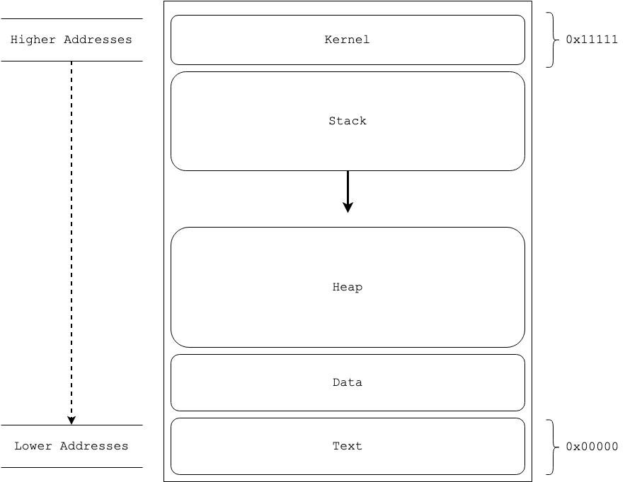
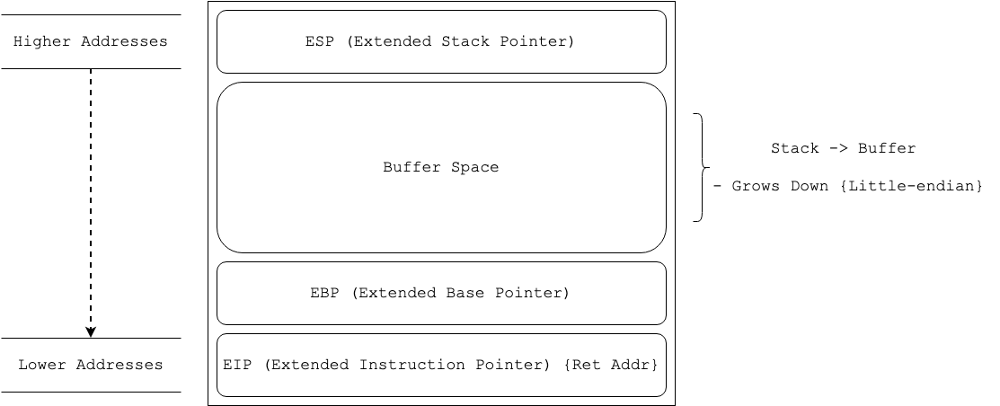

Buffer Overflows
================


## Overview

Buffer Overflows are a type of binary exploitation which arise from poor programing practices && memory allocation in memory managed programing languages like C. They are an example for a 'mixing data && control' vulnrability.

## Occurance

Buffer Overflow vectors/vulnrabilities commonly arise when:

- User data is collected with an unprotected function like `gets()`
- A function or section of code within a program assumes a prameter or variable is of suitible length for the allocated memory
- A length/buffer check is bypassed 


# Theory

## Memory for Buffer Overflows

### Anatomy of Memory



### Anatomy of the Stack

~ Note diagram assumes little-endian addressing




## Executing a Buffer Overflow

### Objectives

#### Broad objectives:

+ Inject input into a vulnerable program such that the buffer space allocated for the input is overwritten
+ Overflow the EBP and reach the EIP by varying the injected string
+ Overwrite the EIP with the memory location of arbitary code to achieve arbitary code execution


### Approach

#### General Steps to pop a shell:

~ Changes based on objective 

1. Spiking
2. Fuzzing
3. Find the Offset
4. Overwriting the EIP
5. Finding bad characters
6. Finding the right module
7. Generating shellcode
8. Obtain shell


# Tooling

## Linux

### GDB

Command line debugger for linux. Should be installed by default. Install:

`sudo apt-get install gdb`

## Windows

### Imunity Debugger


## Mac OS

# Locating

## Spiking

+ Spiking is the process of looking for input vectors that may facilitate a buffer oveflow attack
+ Best optimised with scripts
+ Typically done on remote targets where the binary can't be decompiled

### Using 'generic send tcp'

Generic send tcp is a spiking/fuzzing tool for remote targets.

#### Usage

`generic_send_tcp (host) (port) (spike_script.spk) (SKIPVAR) (SKIPSTR)`

`generic_send_tcp 192.168.0.100 701 login.spk 0 0`

#### Spike Script

```
//Example spike script

s_readline(); //Read standard out (after connect)
s_string("Relevant Server Command to Test "); //Send string to remote prompt
s_string_variable("Argument To Fuzz"); //Send a arbitary argument that generic send tcp will use to fuzz for vulnerabilities 
```

## Fuzzing


# Exploiting