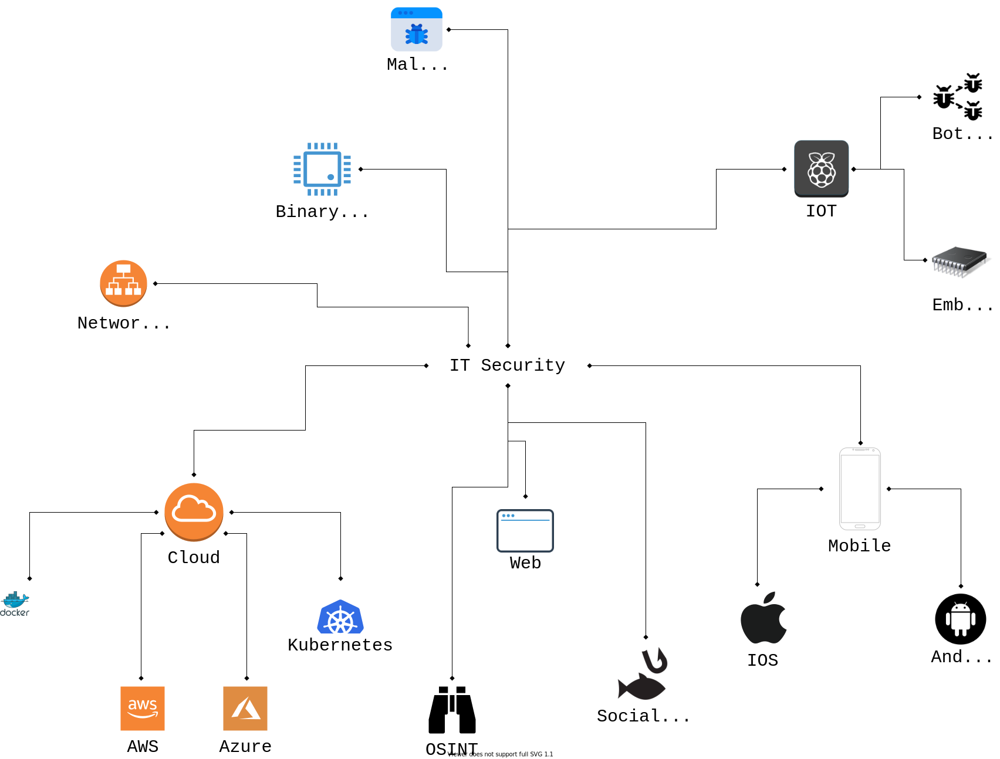

[SecSheets](https://secsheets.cybernetic.coffee/)
==========

SecSheets is a collection of security focused reference 'cheat sheets' for various topics and sub-topics in security. 

## Overview

SecSheets aims to act as a quick reference for exploit categories and to provide an overview of the technical security field. The project aims to provide an overview of all the components and sub-topics that make up various fields in security. Often I have found it fun and helpful to jump between topics in security or to take a deep dive into one niche area. This repo represents that and aims to support it by providing a flyover of many different topics. Often the battle is not knowing a particular thing existed or was possible and this repo hopes to assist with exposing as much information as possible.

This project tries to avoid imitating the amazing [Payload-all-the-things](#) repo and instead tries to provide, example driven explanations, quality references to aid further research, and a sound overview of particular topics in security.

# Contents

## ‣ [Binary Exploitation](./Binary%20Exploitation/README.md) 
## ‣ [Web](./Web/README.md)
<!-- COMING SOON ;) 
## ‣ [Networks](./Networks/README.md)
## ‣ [Mobile](./Mobile/README.md)
## ‣ [Cryptography](./Cryptography/README.md) 
-->