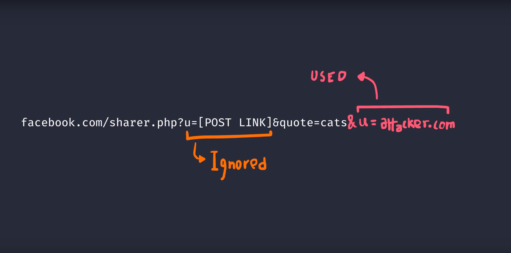
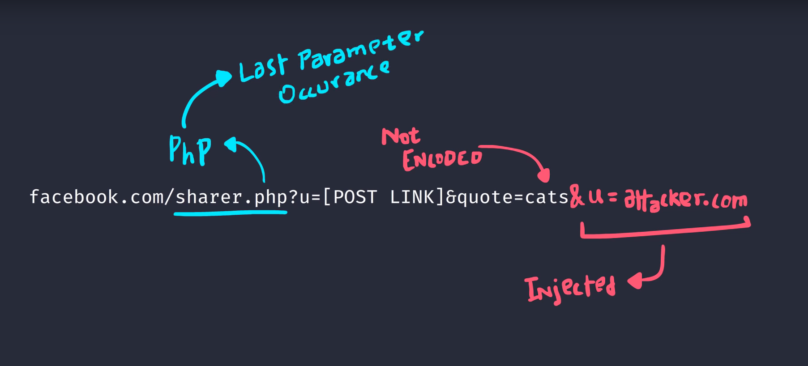

# Parameter Pollution

# Overview

+ Involves sending repeated parameters in URLs with diffrent values
+ For example `https://www.domain.com/posts.php?u=http://facebook.com/81738hha&title=foo&u=attacker.domain.com` 
+ Depending on the backend architecture diffrent things will occur in realtion to the repeated parameter
	+ In some cases the first instance of the parameter will be excepted
	+ In others the last instance of the parameter
	+ In further casesthe parameters may be concatenated together 

# Identification

## Approach

+ Look for URL parameters which are not encoded
+ Attempt to determine what backend infrastructure is running
+ Look at file types used for pages
	+ I.E PHP which will typically use the last instance of the parameter

# Resources

+ [PwnFunction](https://www.youtube.com/watch?v=QVZBl8yxVX0)